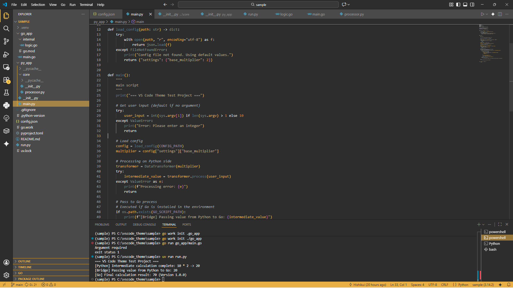

# Thunder Remains Unseen

Theme initialized with preferred visual parameters and operative profiles. 
This dark theme is composed of a yellow and grey color scheme. 
 

Colors of Theme

- **Primary**: #e6b422
- **Sub**: #1a1a1a
- **Background 1**: #2d2d2d
- **Background 2**: #4a4a4a
- **Foreground 1**: #f0f0f0
- **Foreground 2**: #a0a0a0
- **Highlight**: #ffcc00

 

Motifs of Theme

This theme is based on the colors of these characters.

<h3>404: Not Found</h3>

**** 

 

**** 

 

**** 

 

**** 

 

## Sample

    
     

 

## License
MIT License