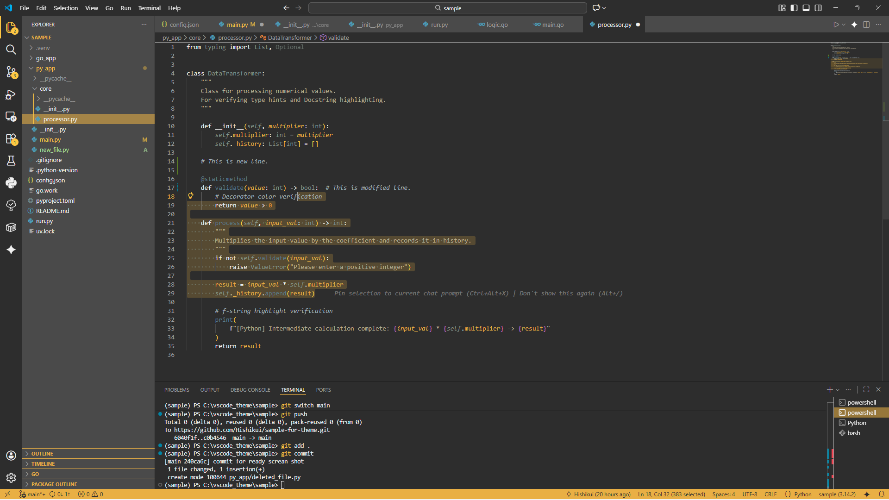

# Thunder Remains Unseen

Theme initialized with preferred visual parameters and operative profiles.

Colors of Theme

- **Primary**: #e6▓▓▓▓
- **Sub**: #5b▓▓▓▓
- **Background 1**: #2d▓▓▓▓
- **Background 2**: #4a▓▓▓▓
- **Foreground 1**: #f0▓▓▓▓
- **Foreground 2**: #a0▓▓▓▓
- **Highlight**: #ff▓▓▓▓

 

Motifs of Theme

This theme is based on the colors of these characters.

<h3>▓▓▓▓ 404</h3>

**▓▓▓▓** 

 

**▓▓▓▓** 

 

**▓▓▓▓** 

 

**▓▓▓▓** 

 

## Sample

    
     

 

## License
MIT License